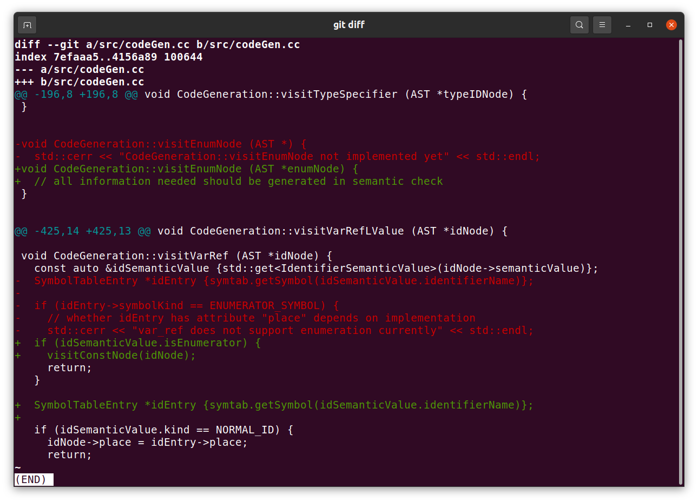

# C-- Compiler
Author:
* B08902107 蘇柏瑄
* B07902123 蔡奇夆

## HW5 - Code Generation

We use `int main ();` instead of `int MAIN ();` as the entry point in the program source code. We use `_start_MAIN` as the entry point in the compiled assembly.

> **Anecdote**
> After finishing all the features required in hw5, Chi-Feng Tsai had been struggling with supporting `enum`. He made the behavior of `visitEnumNode(AST *)` in `codeGen.cc` very similar to `processEnumNode(AST *)` in `semanticAnalysis.cc`, and spent much time on debugging what was wrong with the symbol table. However, the bugs just existed.
> One night, it occurred to Chi-Feng Tsai that `enum` should be treated as compile-time constants. That is to say, the value should have been already prepared in AST nodes after semantic analysis. After confirming this with Brian Su, Chi-Feng Tsai removed all the code in `visitEnumNode(AST *)`, and compiled. Then, all bugs about enum vanished! ALL BUGS VANISHED!!!
> Astonished by the result, Chi-Feng Tsai check the `git diff`:
> 
>
> "*To implement enum, simply remove 'enum not implemented yet' in the code - it suffices*," Chi-Feng Tsai sighed, after wasting lots of time working on it.
